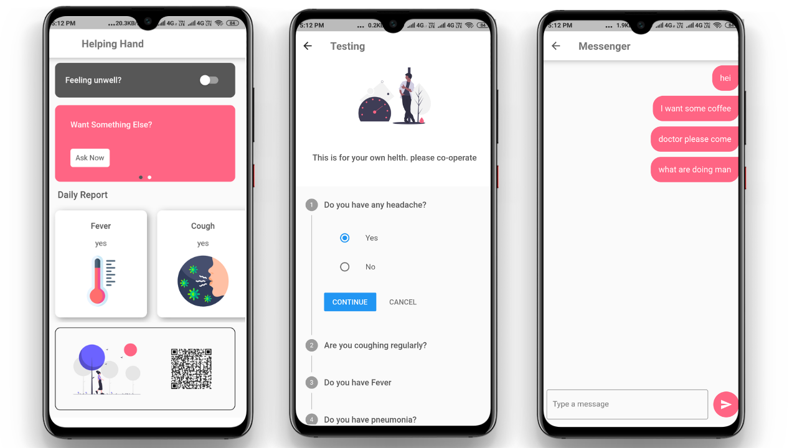

# HelpingHand

This is an app that feature contactless communication between Doctor and Patient to prevent spreading Covid-19

Rename the project to HelpingHand before running

## Getting Started

1. Install and configure Flutter

2. Then from inside the project folder run `flutter run`

3. Make sure to connect your smartphone with `usb debugging` enable

4. or you can use an `Android virtual Device`

ScreenShots:

